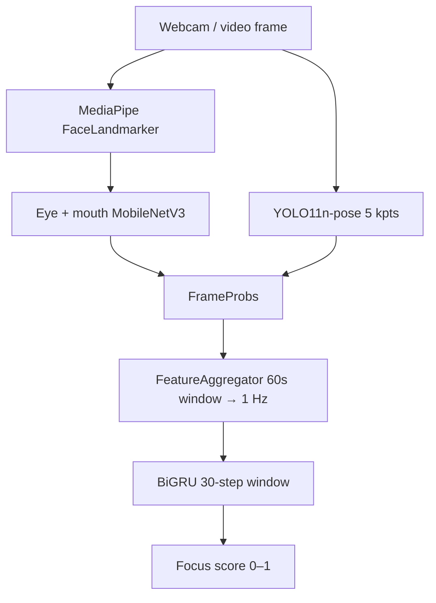

# FatigueSense — Pipeline Reproducibility

Official release package for the FatigueSense vision pipeline: per-frame face ROI
extraction, eye/mouth classification, upper-body pose, 1 Hz feature aggregation,
and BiGRU focus scoring.

This repo contains **`fatigue_pipeline`** (runtime) and **`model_architecture`**
(training + model definitions). They are designed to be used together.

## Pipeline overview



| Phase | Component | Output |
|-------|-----------|--------|
| A | `RegionCropper` | Eye / mouth crops |
| A2 | `PoseEstimator` | 5 upper-body keypoints |
| B | `EyeStateClassifier`, `MouthStateClassifier` | Per-frame probabilities |
| Bridge | `FeatureAggregator` | 17-dim vector each second |
| C | `BiGRUTemporalModel` | Focus score |

## Repository layout

```
fatigue-sense/
├── face_landmarker.task      # MediaPipe bundle (or re-download; see below)
├── fatigue_pipeline/         # Production inference + aggregation
├── model_architecture/       # Models + training scripts
├── scripts/
│   ├── weights_path.py       # All checkpoint paths (edit here)
│   └── live_inference_local.py   # End-to-end webcam demo
└── runs/                     # Created at runtime (logs, local training outputs)
```

Training scripts expect extra data under `data/`, `videos/`, or `training_data/`
(not shipped in this minimal release). Pretrained weights are pulled from
Hugging Face by default.

## Requirements

- Python 3.10+ (3.11–3.13 tested in development)
- Webcam (for the live demo)
- Optional: NVIDIA GPU + CUDA for reasonable FPS

### Install dependencies

From the repo root:

```bash
python -m venv .venv
source .venv/bin/activate          # Windows: .venv\Scripts\activate
pip install torch torchvision --index-url https://download.pytorch.org/whl/cu124
pip install mediapipe opencv-python numpy pandas pyarrow huggingface_hub ultralytics scikit-learn tqdm pyyaml python-dotenv
```

Use the CPU-only PyTorch index if you do not have CUDA.

### Hugging Face authentication

Weights default to `hf://FatigueSense/...` repos. Log in once:

```bash
pip install huggingface_hub
hf auth login
```

Or set a token in the environment:

```bash
export HF_TOKEN=hf_xxxxxxxx   # Windows: set HF_TOKEN=...
```

If a repo is private, your account needs read access to the **FatigueSense** org.

## Configuration

### 1. Checkpoint paths — `scripts/weights_path.py`

Single place to configure all assets:

| Constant | Default | Notes |
|----------|---------|--------|
| `EYE_CKPT` | `hf://FatigueSense/eye_classifier/best_eye_classifier.pt` | Auto-download |
| `MOUTH_CKPT` | `hf://FatigueSense/mouth_classifier/best_mouth_classifier.pt` | Auto-download |
| `POSE_MODEL_PATH` | `hf://FatigueSense/pose_model/best_pose.pt` | Auto-download |
| `TEMPORAL_MODEL_PATH` | `hf://FatigueSense/temporal_model/best_temporal.pt` | Auto-download |
| `NORMALIZATION_PATH` | `hf://FatigueSense/temporal_model/normalization.json` | Required with temporal weights |
| `LANDMARKER_PATH` | `face_landmarker.task` | **Local file** (see below) |

Use `resolve_asset()` for any `hf://` spec or local path. To run fully offline,
download the HF files once and point these constants at local paths instead.

### 2. MediaPipe Face Landmarker

The `.task` bundle is **not** on Hugging Face. Either:

- Use the copy at the repo root (`face_landmarker.task`), or
- Download from Google:
  - Guide: [Face Landmarker](https://ai.google.dev/edge/mediapipe/solutions/vision/face_landmarker)
  - Direct: `https://storage.googleapis.com/mediapipe-models/face_landmarker/face_landmarker/float16/latest/face_landmarker.task`

Set `LANDMARKER_PATH` in `weights_path.py` if you store it elsewhere.

### 3. Live demo tuning — `scripts/live_inference_local.py`

| Constant | Default | Purpose |
|----------|---------|--------|
| `WEBCAM_INDEX` | `0` | Camera device index |
| `DEVICE` | `cuda` if available else `cpu` | Inference device |
| `DEMO_SUB_WINDOW_S` | `60` | Aggregator history window (seconds) |
| `DEMO_STEP_STRIDE_S` | `1` | Feature emit rate (Hz) |
| `WINDOW_STEPS` | `30` | BiGRU context length (steps) |

**Faster smoke test:** set `DEMO_SUB_WINDOW_S = 5` in `live_inference_local.py`.
Metrics will be noisier but the focus score appears sooner (~35 s vs ~90 s cold start).

**Cold start (production defaults):** ~60 s to fill the aggregator sub-window, then
~30 s to fill the BiGRU buffer before the first focus score.

## Test the full pipeline (recommended)

Run from the **repository root** so imports and `face_landmarker.task` resolve:

```bash
cd fatigue-sense
python scripts/live_inference_local.py
```

### What to expect

1. Console prints resolved paths for eye/mouth/pose/temporal assets.
2. A preview window opens with:
   - Left HUD: raw CNN probabilities + 17 aggregated features
   - Right HUD: focus score, blink/yawn counters, FPS
3. First ~90 s (with 60 s sub-window): focus may show `--` until buffers fill.
4. Press **Q** or **Esc** to quit.

### Outputs

- `runs/live_inference_steps.csv` — per-second feature log (overwritten each run)

### Troubleshooting

| Issue | Fix |
|-------|-----|
| `FileNotFoundError: face_landmarker.task` | Download landmarker (above) or fix `LANDMARKER_PATH` |
| HF 401 / 403 | Run `hf auth login` or set `HF_TOKEN` |
| Focus stays `--` | Wait for cold start, or lower `DEMO_SUB_WINDOW_S` |
| CUDA OOM | Set `DEVICE = "cpu"` in `live_inference_local.py` |
| No camera | Change `WEBCAM_INDEX` (try `1`, `2`, …) |

## Reproduce training (optional)

This release includes training entry points; **datasets are hosted separately**
on Hugging Face (see the main FatigueSense development repo for extraction scripts).

### Phase B — Binary eye/mouth classifiers

```bash
python -m model_architecture.train_binary_classifier --roi eyes
```

Configure `DATASET_ROOTS` in `train_binary_classifier.py` (default
`training_data/data/train`). You need a folder-per-class layout or your own
public dataset preparation.

Published weights: `FatigueSense/eye_classifier`, `FatigueSense/mouth_classifier`.

### Pose — YOLO11n upper-body (5 keypoints)

```bash
# Requires data/pose/ (YOLO images + labels + dataset.yaml)
python -m model_architecture.train_yolo_pose
```

Dataset: [FatigueSense-pose](https://huggingface.co/datasets/Jlords32/FatigueSense-pose)
(snapshot download into `data/pose/`).

Published weights: `FatigueSense/pose_model`.

### Phase C — BiGRU temporal model

```bash
# Requires data/temporal/features/*.parquet (one file per video)
python -m model_architecture.train_temporal_model
```

Dataset: [FatigueSense-temporal](https://huggingface.co/datasets/Jlords32/FatigueSense-temporal)
(download `features/` into `data/temporal/features/`).

Outputs: `runs/temporal/best.pt`, `runs/temporal/normalization.json`.

Published weights: `FatigueSense/temporal_model`.

### Download HF datasets (example)

```python
from huggingface_hub import snapshot_download

snapshot_download("Jlords32/FatigueSense-temporal", repo_type="dataset", local_dir="data/temporal_hf")
# Copy or symlink features/ → data/temporal/features/
```

## Programmatic use

```python
from fatigue_pipeline import FatiguePipeline, FeatureAggregator
from fatigue_pipeline.pose_estimator import PoseEstimator

# Pass paths from scripts/weights_path.py or your own.
pipeline = FatiguePipeline(
    face_landmarker_path="face_landmarker.task",
    eye_classifier_path="hf://FatigueSense/eye_classifier/best_eye_classifier.pt",
    mouth_classifier_path="hf://FatigueSense/mouth_classifier/best_mouth_classifier.pt",
)
aggregator = FeatureAggregator(fps=30.0)
# Per frame: probs = pipeline.process_frame(frame); step = aggregator.add(probs)
```

Wire `PoseEstimator` separately and set `FrameProbs.keypoints` before `aggregator.add()`.
See `scripts/live_inference_local.py` for the full loop including BiGRU loading.

## License and citations

Model weights and datasets are published under the **FatigueSense** Hugging Face
organization. Use and redistribution follow each HF repo’s license card.

For the full development repo (data extraction scripts, docs, backend), see the
main FatigueSense project.
