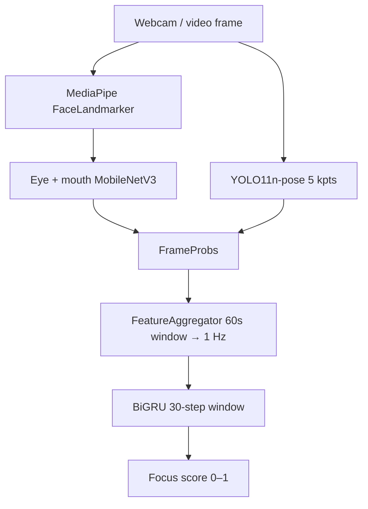

# FatigueSense

Official release package for the FatigueSense vision pipeline: per-frame face ROI
extraction, eye/mouth classification, upper-body pose, 1 Hz feature aggregation,
and BiGRU focus scoring.

This repo contains **`fatigue_pipeline`** (runtime) and **`model_architecture`**
(training + model definitions). They are designed to be used together.

## Pipeline overview



| Phase | Component | Output |
|-------|-----------|--------|
| A | `RegionCropper` | Eye / mouth crops |
| A2 | `PoseEstimator` | 5 upper-body keypoints |
| B | `EyeStateClassifier`, `MouthStateClassifier` | Per-frame probabilities |
| Bridge | `FeatureAggregator` | 17-dim vector each second |
| C | `BiGRUTemporalModel` | Focus score |

## Repository layout

```
fatigue-sense/
├── face_landmarker.task      # MediaPipe bundle (or re-download; see below)
├── fatigue_pipeline/         # Production inference + aggregation
├── model_architecture/       # Models + training scripts
├── scripts/
│   ├── weights_path.py           # All checkpoint paths (edit here)
│   ├── download_hf_datasets.py   # Pull published train data from Hugging Face
│   ├── live_inference_local.py   # Full pipeline webcam demo
│   ├── vision_pipeline.py        # Eyes + mouth only
│   ├── pose_pipeline.py          # Upper-body pose only
│   └── labelling/                # Build datasets from raw videos (see below)
│       ├── cnn/                  # Eye/mouth ROI crops (EAR/MAR weak labels)
│       ├── pose/                 # YOLO pose frames + pseudo-labels
│       └── temporal/             # Per-frame probs + 1 Hz feature Parquets
├── notebooks/                    # eval_cnn.ipynb, eval_pose.ipynb
├── docs/
│   └── training.md           # HF download, labelling pipelines, train commands
└── runs/                     # Created at runtime (logs, local training outputs)
```

Training scripts expect extra data on disk or Hugging Face (not shipped in this
release). **Eye/mouth ROI crops** ship as one zip on HF -see [docs/training.md](docs/training.md).
Pretrained **model weights** auto-download from Hugging Face by default.

## Requirements

- Python 3.10+ (3.11–3.13 tested in development)
- Webcam (for the live demo)
- Optional: NVIDIA GPU + CUDA for reasonable FPS

### Install dependencies (conda)

From the repo root:

```bash
conda create -n fatigue-sense python=3.11 -y
conda activate fatigue-sense
```

**GPU (CUDA 12.4):**

```bash
conda install pytorch torchvision pytorch-cuda=12.4 -c pytorch -c nvidia -y
pip install -r requirements.txt
```

**CPU only:** install PyTorch without CUDA, then the same `pip` line:

```bash
conda install pytorch torchvision cpuonly -c pytorch -y
pip install -r requirements.txt
```

`requirements.txt` pins the rest of the stack (`mediapipe`, `opencv-python`,
`huggingface_hub`, `ultralytics`, etc.).

### Hugging Face assets (no login required)

Published model weights and datasets under the **FatigueSense** org are **public**.
Checkpoints use `hf://FatigueSense/...` specs in `scripts/weights_path.py`; the first
run downloads via `huggingface_hub` (included in `requirements.txt`). You do **not**
need `hf auth login` or `HF_TOKEN` for the defaults.

If you point paths at a **private** repo or mirror, set `HF_TOKEN` or run
`hf auth login` for that account.

## Configuration

### 1. Checkpoint paths  - `scripts/weights_path.py`

Single place to configure all assets:

| Constant | Default | Notes |
|----------|---------|--------|
| `EYE_CKPT` | `hf://FatigueSense/eye_classifier/best_eye_classifier.pt` | Auto-download |
| `MOUTH_CKPT` | `hf://FatigueSense/mouth_classifier/best_mouth_classifier.pt` | Auto-download |
| `POSE_MODEL_PATH` | `hf://FatigueSense/pose_model/best_pose.pt` | Auto-download |
| `TEMPORAL_MODEL_PATH` | `hf://FatigueSense/temporal_model/best_temporal.pt` | Auto-download |
| `NORMALIZATION_PATH` | `hf://FatigueSense/temporal_model/normalization.json` | Required with temporal weights |
| `LANDMARKER_PATH` | `face_landmarker.task` | **Local file** (see below) |

Use `resolve_asset()` for any `hf://` spec or local path. To run fully offline,
download the HF files once and point these constants at local paths instead.

### 2. MediaPipe Face Landmarker

The `.task` bundle is **not** on Hugging Face. Either:

- Use the copy at the repo root (`face_landmarker.task`), or
- Download from Google:
  - Guide: [Face Landmarker](https://ai.google.dev/edge/mediapipe/solutions/vision/face_landmarker)
  - Direct: `https://storage.googleapis.com/mediapipe-models/face_landmarker/face_landmarker/float16/latest/face_landmarker.task`

Set `LANDMARKER_PATH` in `weights_path.py` if you store it elsewhere.

### 3. Live demo tuning  - `scripts/live_inference_local.py`

| Constant | Default | Purpose |
|----------|---------|--------|
| `WEBCAM_INDEX` | `0` | Camera device index |
| `DEVICE` | `cuda` if available else `cpu` | Inference device |
| `DEMO_SUB_WINDOW_S` | `60` | Aggregator history window (seconds) |
| `DEMO_STEP_STRIDE_S` | `1` | Feature emit rate (Hz) |
| `WINDOW_STEPS` | `30` | BiGRU context length (steps) |

**Faster smoke test:** set `DEMO_SUB_WINDOW_S = 5` in `live_inference_local.py`.
Metrics will be noisier but the focus score appears sooner (~35 s vs ~90 s cold start).

**Cold start (production defaults):** ~60 s to fill the aggregator sub-window, then
~30 s to fill the BiGRU buffer before the first focus score.

## Testing the pipeline

Run all demos from the **repository root** so imports and `face_landmarker.task`
resolve:

```bash
cd fatigue-sense
```

Press **q** in the preview window to quit each demo.

| Script | What it exercises |
|--------|-------------------|
| `scripts/vision_pipeline.py` | MediaPipe face ROIs + eye/mouth CNNs |
| `scripts/pose_pipeline.py` | YOLO11n-pose upper-body keypoints (5 kpts) |
| `scripts/live_inference_local.py` | Full stack: vision + pose + aggregator + BiGRU |

Work through the table top to bottom when validating a fresh install, or jump
straight to `live_inference_local.py` if you only need the end-to-end check.

### Vision only (eyes + mouth)

```bash
python scripts/vision_pipeline.py
```

- No warm-up delay; scores update every frame.
- Preview shows face/eye/mouth boxes and `P(L closed)`, `P(R closed)`, `P(mouth open)`.
- Does **not** run pose, `FeatureAggregator`, or the temporal model.
- Requires `face_landmarker.task` and HF eye/mouth weights (see Configuration).

### Pose only

```bash
python scripts/pose_pipeline.py
```

- No warm-up delay; keypoints update every frame.
- Preview draws the 5-kpt upper-body skeleton (nose, ears, shoulders) and per-joint confidence.
- Does **not** run face landmarks, eye/mouth CNNs, or temporal scoring.
- Requires `POSE_MODEL_PATH` (HF auto-download by default).

### Full pipeline (recommended)

> **Warm-up (~90 s):** With default settings, the focus score stays `--` for about
> **90 seconds** after you start. The pipeline needs **~60 s** of frames before
> `FeatureAggregator` emits the first 1 Hz feature, then **~30 s** more (30 BiGRU
> steps at 1 Hz) before the temporal model can score focus. This is expected -not a hang.

```bash
python scripts/live_inference_local.py
```

**What to expect**

1. Console prints resolved paths for eye/mouth/pose/temporal assets.
2. Preview window:
   - Left HUD: raw CNN probabilities + 17 aggregated features
   - Right HUD: focus score, blink/yawn counters, FPS
3. For ~90 s, focus shows `--` while buffers fill (see warm-up note above).

**Faster smoke test:** set `DEMO_SUB_WINDOW_S = 5` in `live_inference_local.py`
(metrics noisier; focus appears sooner).

**Output:** `runs/live_inference_steps.csv` (per-second feature log, overwritten each run).

### Troubleshooting (all demos)

| Issue | Fix |
|-------|-----|
| `FileNotFoundError: face_landmarker.task` | Download landmarker (above) or fix `LANDMARKER_PATH` |
| HF 401 / 403 | Default repos are public; check path/URL. For private mirrors, use `HF_TOKEN` |
| Focus stays `--` (full demo only) | Wait for cold start, or lower `DEMO_SUB_WINDOW_S` |
| CUDA OOM | Set `DEVICE = "cpu"` in the script you are running |
| No camera | Change `WEBCAM_INDEX` in that script (try `1`, `2`, …) |
| Stretched preview | Fixed in `vision_pipeline` / `pose_pipeline`; `live_inference_local` may still letterbox on resize |

## Reproduce training (optional)

See **[docs/training.md](docs/training.md)** for Hugging Face downloads, training commands,
and **[scripts/labelling/README.md](scripts/labelling/README.md)** for building
`data/binary/`, `data/pose/`, and `data/temporal/` from raw `videos/`.

## Programmatic use

```python
from fatigue_pipeline import FatiguePipeline, FeatureAggregator
from fatigue_pipeline.pose_estimator import PoseEstimator

# Pass paths from scripts/weights_path.py or your own.
pipeline = FatiguePipeline(
    face_landmarker_path="face_landmarker.task",
    eye_classifier_path="hf://FatigueSense/eye_classifier/best_eye_classifier.pt",
    mouth_classifier_path="hf://FatigueSense/mouth_classifier/best_mouth_classifier.pt",
)
aggregator = FeatureAggregator(fps=30.0)
# Per frame: probs = pipeline.process_frame(frame); step = aggregator.add(probs)
```

Wire `PoseEstimator` separately and set `FrameProbs.keypoints` before `aggregator.add()`.
See `scripts/live_inference_local.py` for the full loop including BiGRU loading.

## License and citations

Model weights and datasets are published under the **FatigueSense** Hugging Face
organization. Use and redistribution follow each HF repo’s license card.

Dataset preparation from in-house videos lives under `scripts/labelling/` in this
repo. Additional design docs and backend work may exist in the upstream FatigueSense
monorepo.
